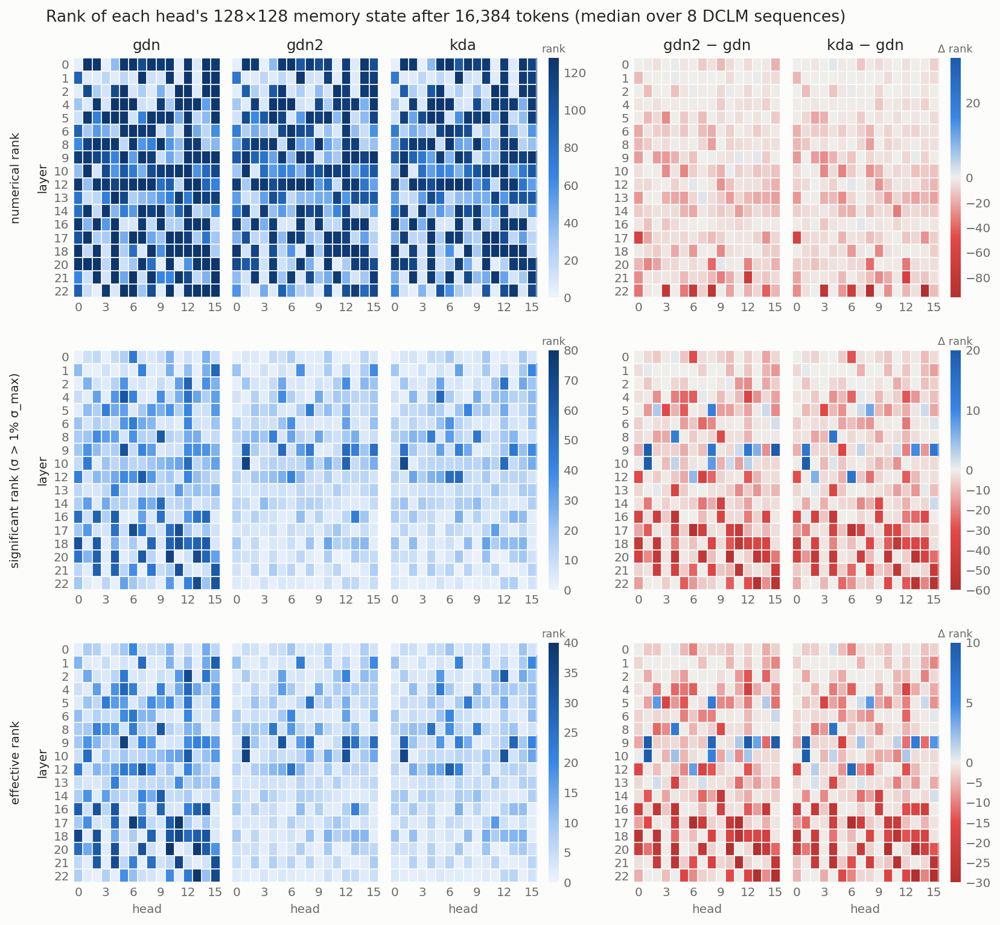

# Rank of the memory state

How much of its 128×128 memory does each linear-attention head actually use, and does swapping the
kernel and distilling change that?  Every head of a Gated-DeltaNet-style layer carries a state
`S ∈ R^{d_k × d_v}` (here 128 × 128) that is updated by rank-one writes, so its rank is bounded by the
number of distinct key directions it has seen and survived the erase and decay.  This note measures that
rank on real text for the unmodified backbone (`gdn`) and the two distilled exact-init students
`gdn2` and `kda`.

All numbers: Qwen3.5-0.8B backbone (18 linear layers × 16 heads, `d_k = d_v = 128`), 8 sequences of
packed DCLM validation text (documents EOS-separated, as in training), state read after prefilling
64 / 128 / 256 / 1K / 4K / 16K tokens.  `gdn2` and `kda` are the final checkpoints of the standard recipe
(`outputs/{gdn2,kda}/distill/checkpoint-16338`); `gdn` is the backbone itself, not the distilled control.
Both students are initialised by tiling GDN head *h* into head *h*, so head indices line up across the
three models.

## Definitions

For one head's state with singular values `σ₁ ≥ … ≥ σ₁₂₈`:

* **numerical rank** — the number of `σᵢ > n·ε·σ₁` with `n = 128` and `ε = 2⁻²³`, i.e. `σᵢ/σ₁ > 1.5·10⁻⁵`,
  the float32 SVD floor (FLA keeps the state in fp32).  Below it a singular value cannot be told
  from round-off, and most of the cut ones sit far lower, at `10⁻¹⁰–10⁻¹⁴`.  **Full rank** means
  numerical rank 128.
* **significant rank** — the number of `σᵢ > 0.01·σ₁`: the directions that carry more than 1 % of the
  dominant one, i.e. what a read `qᵀS` can actually pick up above the leading component.
* **effective rank** — `exp(−Σ pᵢ log pᵢ)` with `pᵢ = σᵢ / Σⱼ σⱼ` (Roy & Vetterli, 2007): the number of
  equally strong directions that would give the same spread of singular values.  It is 1 for a rank-one
  state and 128 for a flat spectrum, needs no threshold, and weighs each direction by its strength.
  **σ₁ share** is `σ₁² / Σ σᵢ²`, the fraction of the state's energy (squared Frobenius norm) in its top
  direction.

A head is summarised by the median over the 8 sequences.  The rank is a property of the head, not
of the text: the median spread (max − min over sequences) is 7.5 for `gdn` and 16–18 for the students,
against a range of 3–128 across heads.

## Results



*Rows: numerical, significant and effective rank.  Columns: the three models, then each student minus
`gdn` (red = the student's state has lower rank).*

### Effective rank: a few directions, one of them dominant

The numerical rank says how many directions the state holds at all; the effective rank says how many
of them matter.  At 16K tokens, per layer, as *median effective rank / median σ₁ share*:

| layer | gdn | gdn2 | kda |
|---|---|---|---|
| 0 | 5.6 / 0.98 | 3.2 / 0.99 | 3.6 / 0.99 |
| 1 | 2.8 / 0.89 | 2.6 / 0.92 | 2.7 / 0.94 |
| 2 | 5.1 / 0.82 | 3.4 / 0.94 | 3.7 / 0.91 |
| 4 | 14.6 / 0.85 | 6.3 / 0.96 | 7.5 / 0.93 |
| 5 | 12.5 / 0.89 | 5.5 / 0.96 | 6.3 / 0.96 |
| 6 | 7.3 / 0.91 | 3.4 / 0.96 | 4.1 / 0.97 |
| 8 | 9.6 / 0.84 | 7.2 / 0.91 | 7.5 / 0.88 |
| 9 | 12.7 / 0.88 | 9.4 / 0.77 | 7.8 / 0.90 |
| 10 | 9.5 / 0.91 | 7.1 / 0.91 | 6.1 / 0.95 |
| 12 | 12.1 / 0.84 | 6.9 / 0.91 | 7.0 / 0.94 |
| 13 | 6.4 / 0.89 | 3.6 / 0.96 | 3.7 / 0.96 |
| 14 | 7.3 / 0.89 | 3.9 / 0.98 | 4.8 / 0.97 |
| 16 | 11.8 / 0.77 | 4.0 / 0.99 | 4.3 / 0.98 |
| 17 | 8.4 / 0.85 | 3.3 / 0.98 | 3.2 / 0.99 |
| 18 | 21.8 / 0.71 | 5.4 / 0.98 | 5.0 / 0.98 |
| 20 | 15.0 / 0.85 | 3.4 / 0.99 | 3.6 / 0.99 |
| 21 | 5.6 / 0.91 | 2.5 / 0.99 | 2.1 / 1.00 |
| 22 | 7.2 / 0.95 | 1.7 / 1.00 | 1.5 / 1.00 |
| all | **8.1** / **0.89** | **4.2** / **0.97** | **4.4** / **0.98** |

Median effective rank over all 2304 states, against prefix length:

| model | 64 | 128 | 256 | 1024 | 4096 | 16384 |
|---|---|---|---|---|---|---|
| gdn | 6.5 | 6.8 | 7.6 | 8.6 | 8.5 | 8.1 |
| gdn2 | 3.5 | 3.8 | 4.0 | 4.5 | 4.6 | 4.2 |
| kda | 3.5 | 3.8 | 4.1 | 4.7 | 4.8 | 4.4 |

Per head at 16K tokens (median over the 8 sequences), `gdn / gdn2 / kda`:

| L | h0 | h1 | h2 | h3 | h4 | h5 | h6 | h7 | h8 | h9 | h10 | h11 | h12 | h13 | h14 | h15 |
|---|---|---|---|---|---|---|---|---|---|---|---|---|---|---|---|---|
| 0 | 1/1/1 | 8/5/5 | 7/4/4 | 1/1/1 | 5/5/5 | 10/5/5 | 20/10/10 | 4/2/3 | 5/3/4 | 6/3/3 | 12/8/8 | 1/1/1 | 5/2/3 | 1/1/1 | 14/8/10 | 6/3/3 |
| 1 | 13/10/10 | 2/2/2 | 1/1/1 | 5/4/4 | 1/1/1 | 3/3/3 | 2/2/2 | 26/22/21 | 2/2/2 | 2/2/2 | 13/8/9 | 2/1/2 | 10/7/7 | 1/1/1 | 14/8/9 | 29/20/20 |
| 2 | 2/1/1 | 14/8/8 | 3/3/3 | 2/2/2 | 7/3/4 | 23/16/17 | 2/3/3 | 4/3/3 | 1/1/1 | 4/3/3 | 3/3/3 | 17/10/12 | 35/21/30 | 2/2/2 | 24/12/14 | 12/10/10 |
| 4 | 4/3/3 | 2/1/1 | 16/6/11 | 2/2/2 | 18/6/8 | 28/17/23 | 22/9/9 | 3/3/3 | 2/1/1 | 21/15/14 | 4/3/4 | 14/8/10 | 27/7/10 | 15/9/9 | 8/6/6 | 17/8/11 |
| 5 | 2/2/2 | 10/3/6 | 6/10/4 | 22/4/5 | 17/9/10 | 17/3/6 | 2/2/2 | 8/6/9 | 19/25/23 | 15/5/8 | 19/10/9 | 7/4/4 | 24/14/14 | 3/3/3 | 4/6/5 | 19/8/11 |
| 6 | 11/8/9 | 3/2/2 | 7/5/5 | 5/3/3 | 4/4/4 | 19/9/10 | 24/20/20 | 12/3/5 | 13/3/4 | 3/2/2 | 3/2/2 | 2/1/1 | 21/16/8 | 3/3/2 | 3/2/2 | 11/12/11 |
| 8 | 9/6/6 | 9/9/9 | 22/10/11 | 17/8/9 | 17/24/25 | 4/3/3 | 22/17/19 | 8/7/7 | 6/3/4 | 31/15/22 | 7/6/6 | 4/3/4 | 13/7/8 | 12/12/10 | 2/2/2 | 4/4/4 |
| 9 | 9/2/3 | 18/32/28 | 13/10/10 | 6/3/4 | 6/5/5 | 37/31/18 | 5/3/3 | 20/17/22 | 17/25/14 | 2/1/1 | 3/2/2 | 3/5/5 | 19/31/8 | 21/25/27 | 21/9/9 | 16/26/21 |
| 10 | 4/4/4 | 26/37/36 | 2/1/1 | 9/4/4 | 5/7/6 | 9/5/5 | 5/4/4 | 7/7/7 | 9/15/6 | 11/4/5 | 15/15/9 | 16/7/6 | 30/32/32 | 5/4/4 | 11/9/9 | 17/15/15 |
| 12 | 23/6/6 | 3/2/2 | 13/8/14 | 9/9/8 | 16/12/15 | 23/14/15 | 21/25/29 | 31/12/21 | 19/5/5 | 5/2/3 | 10/9/10 | 3/2/2 | 21/7/6 | 12/6/7 | 7/6/6 | 4/3/3 |
| 13 | 5/3/3 | 3/3/3 | 2/3/3 | 5/4/4 | 22/4/5 | 6/3/3 | 3/2/2 | 6/7/7 | 5/4/4 | 7/5/5 | 5/3/3 | 19/7/9 | 7/3/4 | 10/3/3 | 7/5/7 | 13/6/7 |
| 14 | 8/7/7 | 18/4/9 | 2/2/2 | 16/9/7 | 8/7/7 | 6/4/4 | 6/2/3 | 20/8/9 | 14/7/7 | 30/5/11 | 5/4/4 | 5/2/3 | 8/2/3 | 2/1/1 | 4/2/2 | 7/4/8 |
| 16 | 30/9/8 | 4/2/4 | 32/7/9 | 7/3/3 | 32/5/6 | 2/1/1 | 2/1/1 | 16/11/13 | 2/2/2 | 28/8/7 | 3/2/2 | 3/1/1 | 21/8/7 | 29/22/11 | 32/8/11 | 2/1/1 |
| 17 | 9/2/2 | 19/3/6 | 3/2/2 | 3/2/2 | 27/6/7 | 3/2/1 | 38/7/5 | 26/4/5 | 6/3/2 | 3/2/2 | 29/6/7 | 40/9/17 | 9/6/4 | 2/1/1 | 10/4/4 | 3/2/2 |
| 18 | 36/9/10 | 2/1/1 | 33/6/11 | 1/1/1 | 15/3/3 | 3/2/2 | 8/4/3 | 1/1/1 | 29/10/11 | 2/1/1 | 31/13/14 | 35/7/8 | 26/9/12 | 29/13/13 | 32/12/13 | 2/1/1 |
| 20 | 27/4/5 | 14/3/4 | 30/4/4 | 2/1/1 | 33/6/7 | 1/1/1 | 4/2/2 | 33/8/9 | 4/2/2 | 1/1/1 | 44/9/10 | 1/1/1 | 3/1/1 | 39/9/7 | 30/7/9 | 18/6/4 |
| 21 | 6/5/2 | 1/1/1 | 31/8/7 | 1/1/1 | 34/8/7 | 6/3/2 | 21/7/7 | 1/1/1 | 25/7/5 | 3/1/1 | 6/2/2 | 35/6/7 | 4/1/1 | 1/1/1 | 4/2/2 | 33/9/7 |
| 22 | 8/2/3 | 1/2/1 | 1/1/1 | 7/3/1 | 1/1/1 | 19/3/3 | 11/2/1 | 4/2/2 | 3/1/1 | 1/1/1 | 19/4/2 | 1/1/1 | 23/6/6 | 41/5/6 | 11/2/1 | 35/4/3 |

### Full rank is rare, and distillation makes it rarer

States at rank 128, out of 18 layers × 16 heads × 8 sequences = 2304:

| model | 64 | 128 | 256 | 1K | 4K | 16K tokens |
|---|---|---|---|---|---|---|
| gdn | 0 | 0 | 11 | 72 | 114 | 127 |
| gdn2 | 0 | 0 | 0 | 4 | 9 | 9 |
| kda | 0 | 0 | 0 | 10 | 19 | 13 |

No head is full rank on all 8 sequences in any model.  In `gdn`, 41 heads reach 128 on at least one
sequence; in `gdn2` and `kda`, 6 and 8.  A near-full head typically sits at 124–127: the last one or
two directions keep being erased or decayed away faster than new keys fill them.

### Per layer

At 16K tokens, as *full-rank states (of 128) / median numerical rank / median significant rank*:

| layer | gdn | gdn2 | kda |
|---|---|---|---|
| 0 | 8 / 125 / 9 | 0 / 114 / 4 | 1 / 120 / 5 |
| 1 | 0 / 14 / 5 | 0 / 14 / 5 | 0 / 14 / 5 |
| 2 | 7 / 38 / 11 | 1 / 33 / 8 | 2 / 32 / 8 |
| 4 | 8 / 124 / 28 | 2 / 111 / 13 | 2 / 110 / 15 |
| 5 | 1 / 124 / 25 | 1 / 98 / 12 | 0 / 109 / 14 |
| 6 | 1 / 51 / 15 | 0 / 41 / 8 | 0 / 41 / 10 |
| 8 | 2 / 99 / 20 | 2 / 84 / 16 | 3 / 82 / 17 |
| 9 | 3 / 121 / 23 | 0 / 111 / 18 | 0 / 110 / 18 |
| 10 | 1 / 101 / 20 | 0 / 82 / 15 | 0 / 80 / 14 |
| 12 | 7 / 123 / 22 | 1 / 120 / 14 | 3 / 118 / 15 |
| 13 | 0 / 72 / 14 | 0 / 53 / 8 | 0 / 52 / 9 |
| 14 | 6 / 73 / 15 | 0 / 57 / 9 | 0 / 57 / 11 |
| 16 | 9 / 97 / 24 | 0 / 73 / 7 | 0 / 69 / 10 |
| 17 | 8 / 88 / 18 | 0 / 51 / 7 | 1 / 47 / 7 |
| 18 | 23 / 126 / 40 | 2 / 111 / 10 | 1 / 115 / 11 |
| 20 | 16 / 126 / 27 | 0 / 101 / 8 | 0 / 113 / 7 |
| 21 | 10 / 71 / 13 | 0 / 39 / 6 | 0 / 44 / 5 |
| 22 | 17 / 109 / 13 | 0 / 42 / 3 | 0 / 30 / 3 |

### Per head

Median numerical rank at 16K tokens, `gdn / gdn2 / kda`; **bold** = at most 20 in all three.

| L | h0 | h1 | h2 | h3 | h4 | h5 | h6 | h7 | h8 | h9 | h10 | h11 | h12 | h13 | h14 | h15 |
|---|---|---|---|---|---|---|---|---|---|---|---|---|---|---|---|---|
| L | h0 | h1 | h2 | h3 | h4 | h5 | h6 | h7 | h8 | h9 | h10 | h11 | h12 | h13 | h14 | h15 |
|---|---|---|---|---|---|---|---|---|---|---|---|---|---|---|---|---|
| 0 | **3/3/3** | 127/125/125 | 127/122/124 | **3/3/3** | 36/37/37 | 126/123/124 | 128/127/127 | 109/99/98 | 126/122/124 | 122/107/117 | 125/119/123 | **4/4/4** | 126/120/122 | **7/6/6** | 127/125/126 | 124/106/115 |
| 1 | 90/75/74 | **5/5/5** | **6/5/5** | **19/19/19** | **5/5/5** | **19/18/18** | **7/7/7** | 127/126/126 | **12/12/12** | **9/9/8** | 125/119/119 | **5/5/5** | 126/124/123 | **5/5/5** | 126/122/122 | 125/120/119 |
| 2 | **4/4/4** | 109/94/94 | 26/24/24 | **10/10/10** | 110/97/97 | 126/123/123 | **9/10/10** | 26/25/25 | **6/6/6** | 42/35/35 | **10/10/10** | 127/126/127 | 127/120/124 | **6/6/6** | 126/122/122 | 126/125/126 |
| 4 | 31/28/29 | **6/5/5** | 124/120/121 | **9/8/8** | 127/125/125 | 128/127/127 | 127/126/126 | **12/11/11** | **8/6/7** | 121/111/109 | 27/26/25 | 125/121/123 | 126/121/121 | 126/122/122 | 50/42/42 | 126/125/125 |
| 5 | **12/11/11** | 124/109/117 | 69/63/48 | 127/98/109 | 126/126/126 | 126/115/123 | **11/9/9** | 68/54/58 | 125/124/124 | 124/118/120 | 127/126/125 | 43/38/38 | 127/126/126 | **18/15/15** | 37/37/36 | 125/115/120 |
| 6 | 91/71/72 | 28/24/22 | 54/44/44 | 43/32/33 | 24/19/20 | 124/112/113 | 127/125/124 | 123/108/114 | 124/104/107 | **11/9/9** | 42/33/34 | **10/8/8** | 126/122/119 | 45/35/37 | **19/14/14** | 60/58/56 |
| 8 | 62/46/46 | 116/106/104 | 125/122/123 | 125/119/120 | 126/125/125 | **18/15/15** | 126/125/126 | 56/49/49 | 68/45/45 | 127/127/127 | 56/47/48 | 37/31/32 | 124/119/121 | 123/120/122 | 27/22/22 | 38/34/34 |
| 9 | 120/96/96 | 124/124/124 | 114/89/90 | 102/78/74 | 67/49/49 | 127/122/122 | 51/38/39 | 125/125/125 | 120/120/113 | **15/12/11** | 46/42/41 | 27/28/27 | 127/125/119 | 124/125/124 | 126/116/118 | 127/126/126 |
| 10 | 34/30/29 | 126/126/126 | **9/8/7** | 111/83/81 | 56/53/50 | 98/67/66 | 71/62/61 | 42/40/40 | 108/98/81 | 121/103/102 | 123/123/120 | 126/117/118 | 127/122/123 | 58/45/45 | 85/76/74 | 112/98/98 |
| 12 | 126/121/118 | 34/27/28 | 125/123/125 | 123/122/119 | 116/107/107 | 124/121/123 | 125/126/126 | 127/127/127 | 126/123/120 | 80/53/53 | 93/80/82 | **19/15/16** | 127/123/122 | 127/122/124 | 87/76/76 | 67/49/51 |
| 13 | 77/52/52 | **13/12/12** | **19/19/18** | 69/51/51 | 127/106/111 | 112/88/84 | 24/17/17 | 36/37/35 | 42/37/37 | 55/45/45 | 68/44/43 | 122/115/115 | 72/56/55 | 125/105/103 | 118/98/101 | 119/96/97 |
| 14 | 80/70/70 | 125/118/119 | **17/13/13** | 126/121/123 | 40/34/34 | 70/53/53 | 54/34/36 | 127/124/124 | 117/110/103 | 128/117/122 | 42/36/37 | 88/64/54 | 125/112/116 | 21/15/14 | 31/20/20 | 62/47/52 |
| 16 | 126/124/125 | 39/26/35 | 127/126/126 | 54/43/42 | 127/121/123 | **9/7/7** | **9/8/8** | 123/123/124 | **18/16/16** | 127/123/123 | 24/19/22 | 25/18/17 | 127/123/123 | 126/125/124 | 127/126/125 | **11/9/9** |
| 17 | 101/41/40 | 127/105/120 | 24/18/19 | 27/21/21 | 127/123/125 | 44/37/27 | 127/123/123 | 127/118/122 | 47/32/33 | 32/23/23 | 127/125/125 | 128/124/127 | 119/116/107 | 26/18/19 | 77/50/51 | 29/22/20 |
| 18 | 128/126/127 | **17/11/11** | 126/116/117 | **12/9/10** | 126/106/118 | 25/20/20 | 82/57/57 | **8/7/6** | 127/126/126 | 58/28/28 | 126/121/122 | 128/124/126 | 127/124/126 | 128/127/127 | 128/118/126 | 26/16/17 |
| 20 | 128/111/118 | 127/96/120 | 127/105/114 | **19/12/12** | 127/120/123 | **13/11/10** | 30/24/24 | 126/123/119 | 80/42/42 | **4/5/3** | 128/126/126 | **6/4/4** | 57/26/23 | 127/120/122 | 126/120/123 | 127/109/122 |
| 21 | 64/36/42 | **13/10/9** | 127/122/124 | **10/7/7** | 127/123/122 | 47/31/31 | 127/121/126 | **15/8/8** | 125/110/111 | 65/32/36 | 64/45/45 | 128/124/125 | 111/40/49 | **18/10/10** | 41/30/29 | 127/121/122 |
| 22 | 92/57/64 | **15/12/11** | **3/3/3** | 124/44/40 | **8/7/7** | 127/92/102 | 126/51/58 | 31/23/25 | 107/23/15 | **5/4/4** | 127/104/99 | **4/4/4** | 123/106/107 | 128/120/124 | 126/85/9 | 128/112/113 |

## Observations

* **The state is dominated by one direction.**  The median effective rank is 8.1 in `gdn` and 4.2–4.4
  in the students, against a median numerical rank of 71–102: σ₁ alone holds 89 % of the energy in
  `gdn` and 97–98 % in the students (median σ₁/σ₂ = 4.1 in `gdn`, 7.2 in `gdn2`, 9.0 in `kda`).  The effective rank
  settles within ~1K tokens and does not grow after that (it drops slightly from 4K to 16K), so longer
  context adds new near-zero directions, not new strong ones.
* **Distillation halves the effective rank, and the deep layers take most of it.**  90 % (`gdn2`) and 92 %
  (`kda`) of heads lose effective rank.  Over layers 0–10 a head keeps a median 77–79 % of its `gdn`
  value, over layers 12–22 48 %.  Of the 67 heads with effective rank ≥ 20 in `gdn`, 44 are in layers
  12–22, and those 67 fall to a median of 9–10 in the students.  Examples: layer 20 head 10 goes 44 → 9 / 10,
  layer 17 head 11 40 → 9 / 17, layer 22 head 13 41 → 5 / 6.  Unlike the numerical rank, which keeps its
  per-head pattern (correlation 0.97), the effective rank is reshuffled: its per-head correlation with
  `gdn` is only 0.58 (`gdn2`) and 0.64 (`kda`).
* **A handful of mid-layer heads gain.**  Layers 8–10 hold the only clear increases, the same in both
  students: layer 9 head 1 (18 → 32 / 28), layer 10 head 1 (26 → 37 / 36), layer 9 head 12 (19 → 31 in
  `gdn2`), layer 8 head 4 (17 → 24 / 25).
* **Every layer mixes near-empty and near-full heads.**  The rank is set per head, not per layer:
  layer 1 has ten heads at rank 5–19 and six at 90–127; layer 0 heads 0, 3, 11 sit at rank 3–4
  while eleven of its other heads are at 109–128.  Low-rank heads are low-rank at every length — layer 1 is
  at a median of 14–17 from 64 tokens to 16K — so their keys span a fixed small subspace rather than
  running out of text.
* **The low-rank heads come from the backbone, not the swap.**  All 57 heads at rank ≤ 20 in `gdn`
  stay there in both students, and per-head rank correlates at 0.97 between `gdn` and either student
  (0.99 between `gdn2` and `kda`).  Distillation keeps each head's character and lowers its rank by
  about 9 on average.
* **The significant rank falls much further than the numerical one.**  The median head carries 15.5
  directions above 1 % of `σ₁` in `gdn` and 9–9.5 in the students; 80 % of heads lose some.  The loss
  is concentrated in the second half of the network: over layers 12–22 the students keep 36–42 % of
  `gdn`'s significant rank, over layers 0–10 about 75 %.  Layer 18 head 11 goes from 66 to 15–16,
  layer 20 head 10 from 73 to 16–21, and heads that keep a numerical rank near 125 do so with a
  handful of significant directions.
* **The largest numerical-rank losses are a few deep heads**: layer 22 head 3 (124 → 44 / 40),
  head 8 (107 → 23 / 15), head 6 (126 → 51 / 58), layer 21 head 12 (111 → 40 / 49), layer 17 head 0
  (101 → 41 / 40).  Layer 22 head 14 is the one head where the two students disagree (126 → 85 in
  `gdn2`, 9 in `kda`).
* **`gdn2` and `kda` are nearly indistinguishable here.**  GDN-2's separate erase and write gates and
  KDA's per-channel decay lead to the same per-head numerical ranks within a few units almost
  everywhere, and to the same effective-rank pattern, with a few heads apart (layer 9 head 12: 31 in
  `gdn2`, 8 in `kda`).

**Open: swap or recipe?**  The reference here is the unmodified backbone, not the control (the backbone
put through the same three distillation steps), whose checkpoint is not kept.  The framework results
show the recipe alone moves the control as much as the students on both benchmark suites, so the rank
loss may be the recipe's rather than the swap's; the two students agreeing with each other this closely
is consistent with either.  Rerunning `tools/state_rank.py` on a control checkpoint settles it.  Whether
the loss costs anything is a separate question: the students match the control on short-context tasks
and sit 4–11 points below it on the 128K distractor needle
([framework.md](framework.md#results-qwen35-08b-one-seed)).

## Reproduce

```bash
python tools/state_rank.py --name gdn                                              # tens of minutes per model, mostly Triton autotuning
python tools/state_rank.py --name gdn2 --ckpt outputs/gdn2/distill/checkpoint-16338
python tools/state_rank.py --name kda  --ckpt outputs/kda/distill/checkpoint-16338
python tools/state_rank_report.py gdn gdn2 kda     # tables, outputs/state_rank/per_head_rank.csv, the figure
```

`state_rank.py` stores the full singular-value spectra (`outputs/state_rank/<name>.json`), so other
thresholds need no rerun.  The report script needs only numpy and matplotlib.
